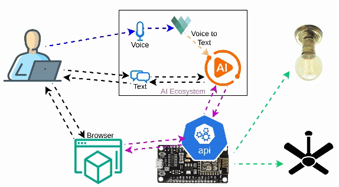

# 🏡 AI Home Automation / Control
Smart Home with AI: Your private AI Agent using LangGraph, LangChain, Ollama to control home appliances which are being controlled via Micro-controllers like ESP32, ESP8266 etc. It is designed to work completely offline &amp; private in nature. Users can interact to the AI with text prompts or voice commands to control the home appliances. This is a prototype which can be improved and modified hugely

## 📽️ Demo
You can click on the below Image or this [Youtube Link](https://www.youtube.com/watch?v=YZJlYPuJBdM) to see the demo. Please let me know in the comments, how do you feel about this App.
<iframe width="560" height="315" src="https://www.youtube.com/embed/YZJlYPuJBdM?si=HKZDGI5t7qTtNiQi" title="YouTube video player" frameborder="0" allow="accelerometer; clipboard-write; encrypted-media; gyroscope; picture-in-picture; web-share" referrerpolicy="strict-origin-when-cross-origin" allowfullscreen></iframe>

## 🖧 Our Scematic Architecture
This is the scematic flow [diagram](./docs/images/flowDiagram.jpg) <br>


---

## 🧑‍💻 Quickstart Guide
Let's go step by step.

### 🦾 Setting up the ESP8266
1. Below is the scematic connection [diagram](./docs/images/wifiSwitch.jpg). Connect your appliances accordingly. You can Checkout my [DIY-Video](https://youtu.be/Xoi3wdvYqV0?si=PjAiNiwiC0Vs7xXj) to get more insight.
<a href="https://youtu.be/Xoi3wdvYqV0?si=4HhcSEV_MDXQLTdh">
  
</a>

2. Load the Code on ESP8266 using Arduino IDE
    * Change the code with your WiFi `SSID` & `Password` [here](./esp8266/ledControlApi.ino)
    ```cpp
    /* Put SSID & Password of your Router*/
    const char* ssid = "daslearning";
    const char* password = "123456789";
    ```
    * You need to install [ArduinoJson](https://github.com/bblanchon/ArduinoJson) library explicitly (Other libraries are managed automatically when we install the ESP8266 Board manager)
    * Optionally, you can upload the [data](./esp8266/data/) folder to static memory using any upload tool such as [LittleFS-DataUpload](https://github.com/earlephilhower/arduino-esp8266littlefs-plugin) to use the direct `HTML` based website to control the LEDs & bypass the `AI`.
    * Finally, upload the sketch (program) from IDE & Volla, your ESP8266 is ready.

### 🤖 Setting up your AI platform

#### 💻 Run Ollama Backend
1. Install Ollama on your system from the [official website](https://ollama.com/download)
2. Then Pull the required models
    ```bash
    ollama pull llama3.2
    # Check the models
    ollama list
    ```

#### 🐍 Run the `Python` AI App
You can check the App [directory](./aiAgents/) to get more insights

1. Steps to run the App
    ```bash
    cd ./aiAgents/

    # Install the dependencies
    pip install -r requirements.txt # virtual environment is recommended

    # Set the required enviroment variables (use `setx` command on windows)
    export HOME_API_BASE="http://<your-esp8266-ip>" # This is needed for the AI app to connect to ESP8266
    export OLLAMA_API_BASE="http://<your-ollama-ip>:<port>" # Optional: defaults to localhost:11434
    export AUDIO_MODEL="<other-vosk-model>" # Optional: default to `en-in` (Indian English small)

    # Run the APP
    python app.py
    ```

2. Access the App at `http://localhost:7860` from the same device or `http://<IP>:7860` from another device in the local network. <br>Please note: the `microphone` access would be disabled on other devices as the app is not running on `HTTPS`.

## ✉️ Contact Information
Please visit our contact page 👉🏽 [Contact Us](https://daslearning.in/contact/)
